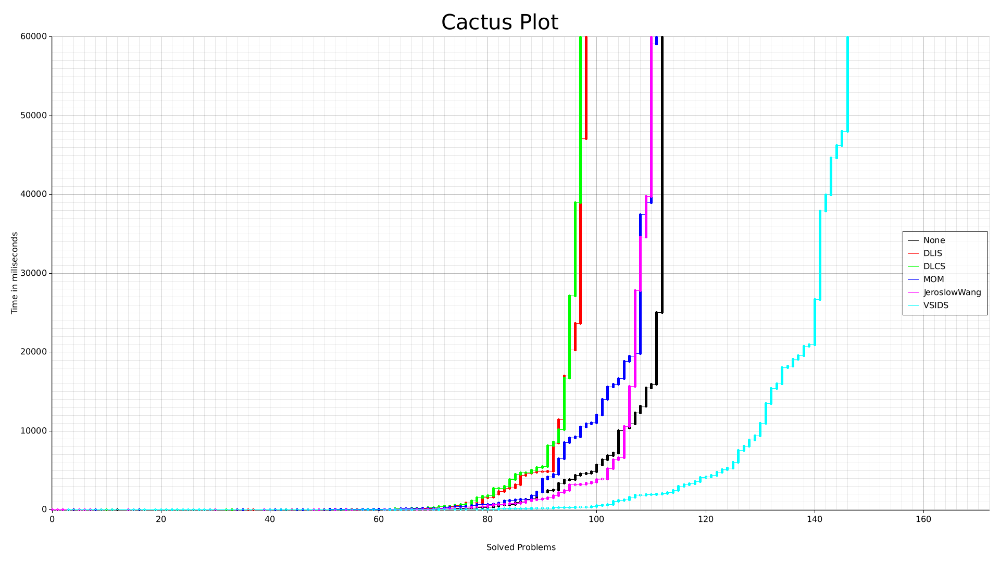

# Rustsolver

a simple dpll algorithm with basic heuristics

 Cactus plot with one minute of cpu time for each problem. 

## setup

### debug build
```bash
cargo build
```

### release build
```bash
cargo build --release
```

## usage

directly over cargo or use the build binary

### binary

```bash
./target/release/dpll -h

Usage: dpll <COMMAND>

Commands:
  test       run the test function
  tests      run the tests on the given directory
  benchmark  runs the benchmark on the given directory, uses all of your cpu power
  solve      solve the given cnf file
  help       Print this message or the help of the given subcommand(s)

Options:
  -h, --help     Print help
  -V, --version  Print version
```

### solve

```bash
./target/release/dpll solve -h
Usage: dpll solve <FILE> [HEURISTIC]

Arguments:
  <FILE>       The file to run
  [HEURISTIC]  The heuristic to use [possible values: none, mom, dlis, dlcs, jeroslow-wang]

Options:
  -h, --help  Print help
```

### cargo

```bash
cargo run --release -- -h
Usage: dpll <COMMAND>

Commands:
  test       run the test function
  tests      run the tests on the given directory
  benchmark  runs the benchmark on the given directory, uses all of your cpu power
  solve      solve the given cnf file
  help       Print this message or the help of the given subcommand(s)

Options:
  -h, --help     Print help
  -V, --version  Print version
```

#### solve 

```bash
cargo run --release -- solve -h
Usage: dpll solve <FILE> [HEURISTIC]

Arguments:
  <FILE>       The file to run
  [HEURISTIC]  The heuristic to use [possible values: none, mom, dlis, dlcs, jeroslow-wang]

Options:
  -h, --help  Print help
```

## Log

set the RUST_LOG environment variable to get log to sdtout. For debug use 
`RUST_LOG=debug` this make the program really slow so use it only for debuging. If you want to se the time it took to solve the cnf use
`RUST_LOG=info`

## example 

```bash
RUST_LOG=info cargo run --release -- solve ./data/inputs/sat/aim-50-1_6-yes1-1.cnf jeroslow-wang

[2024-01-18T11:45:13Z INFO  dpll] solved in 14.720015ms
s SATISFIABLE
v -1 2 3 -4 -5 -6 7 8 9 -10 -11 -12 -13 14 -15 -16 17 18 19 20 21 22 23 24 -25 26 27 28 -29 30 31 -32 -33 -34 35 36 -37 38 39 40 41 42 43 -44 -45 46 -47 48 -49 -50
```
```bash
cargo run --release -- solve ./data/inputs/sat/aim-50-1_6-yes1-1.cnf jeroslow-wang

s SATISFIABLE
v -1 2 3 -4 -5 -6 7 8 9 -10 -11 -12 -13 14 -15 -16 17 18 19 20 21 22 23 24 -25 26 27 28 -29 30 31 -32 -33 -34 35 36 -37 38 39 40 41 42 43 -44 -45 46 -47 48 -49 -50
```

```bash
RUST_LOG=info ./target/release/dpll solve ./data/inputs/sat/aim-50-1_6-yes1-1.cnf jeroslow-wang

[2024-01-18T11:45:13Z INFO  dpll] solved in 14.720015ms
s SATISFIABLE
v -1 2 3 -4 -5 -6 7 8 9 -10 -11 -12 -13 14 -15 -16 17 18 19 20 21 22 23 24 -25 26 27 28 -29 30 31 -32 -33 -34 35 36 -37 38 39 40 41 42 43 -44 -45 46 -47 48 -49 -50
```
```bash
./target/release/dpll solve ./data/inputs/sat/aim-50-1_6-yes1-1.cnf jeroslow-wang

s SATISFIABLE
v -1 2 3 -4 -5 -6 7 8 9 -10 -11 -12 -13 14 -15 -16 17 18 19 20 21 22 23 24 -25 26 27 28 -29 30 31 -32 -33 -34 35 36 -37 38 39 40 41 42 43 -44 -45 46 -47 48 -49 -50
```
